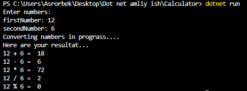

# Calculator

This progect

Have a look at `Program.cs` file and you ccan see how I have used:

* **Console input/output.**
* **Conversion between data types.**
* **Arithmetic operetion.**

## Demo

